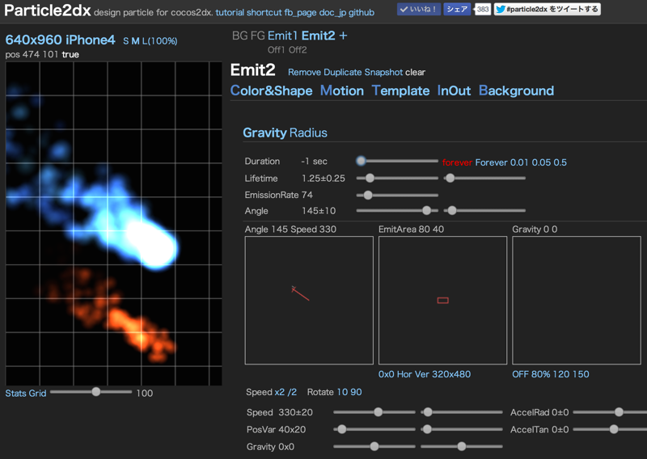

# Particle2dx — Editor Only

*[English](README.md) · 한국어*

[EffectHub](http://www.effecthub.com) 소스에서 **파티클 에디터만** 남긴 오프라인 빌드.
cocos2d-x / Cocos2d-JS / CoronaSDK 용 파티클(`.plist`, `.json`)을 브라우저에서 만들고 바로 내려받는다.

DB · PHP · 로그인 · 서버 API 전부 필요 없다. 정적 파일 서버 하나면 끝.



## 실행

```sh
python -m http.server 8000      # 또는: npx serve -l 8000
```

그리고 <http://localhost:8000> 을 Chrome / Edge / Firefox 로 연다.

> `index.html` 을 파일로 직접 여는 것(`file://`)은 안 된다. 템플릿(`particle/`, `plist/`)을
> XHR 로 읽기 때문에 브라우저가 차단한다. 아무 정적 서버든 하나 띄우면 된다.

## 사용법

| 패널 | 하는 일 |
|---|---|
| **Color&Shape** | 텍스처 선택 / 시작·종료 색 / 크기 / 블렌드 |
| **Motion** | Gravity·Radius 모드, 수명, 방출량, 각도, 속도, 중력 |
| **Template** | 41개 기본 프리셋 (마우스 올리면 미리보기) |
| **Export** | 파일로 저장 (아래) |
| **Background** | 배경색, 배경/전경 PNG 드래그&드롭 |

캔버스에 `.plist` / `.json` / `.alljson` 파일을 드래그&드롭하면 그대로 불러온다.
`DropPNG` 칸에 PNG 를 떨구면 파티클 텍스처로 쓴다.

단축키: `Alt+C/M/T/E` 패널 전환, `Alt+←→` 회전, `Alt+↑↓` 크기, `Alt+A` 이미터 추가,
`Alt+1~9` 이미터 선택/숨김, `Alt+D` 복제, `Alt+S` 스냅샷, `Alt+P` plist 저장.

### 내보내기 (Export 패널)

| 버튼 | 결과물 |
|---|---|
| cocos 아이콘 (PNG Contained) | `.plist` — 텍스처를 gzip+base64 로 품은 단일 파일 |
| cocos 아이콘 + `particle_texture.png` | `.plist` + PNG 를 따로 |
| corona 아이콘 + `particle_texture.png` | CoronaSDK `.json` + PNG |
| AllJson | 모든 이미터를 한 파일로 (`.alljson`, 이 에디터 전용) |

`filename` 칸이 저장 파일 이름이 된다.

## 파일 구조

```
index.html      에디터 UI 전부
myApp.js        에디터 로직 (cocos2d-html5 씬)
main.js         cocos2d 부팅
cocos2d.js      엔진 설정
assets.js       png/ 와 plist/ 목록 + 텍스처의 gzip+base64  ← 생성물
gen_assets.py   assets.js 를 만드는 스크립트
png/            기본 텍스처
plist/          기본 프리셋
particle/       plist / corona json 템플릿
res/            가이드용 이미지
```

`png/` 나 `plist/` 에 파일을 추가했으면 목록을 다시 만든다:

```sh
python gen_assets.py
```

## 원본에서 바뀐 점

원래 이 에디터는 PHP 가 파일 목록·gzip·다운로드 헤더를 만들어 줬고, 저장은 EffectHub 계정(DB)으로 갔다.
전부 브라우저 기능으로 바꿔서 서버가 필요 없게 했다.

- 파일 목록(`ls`) → `assets.js` (빌드 시 생성)
- PNG gzip(`gzencode`) → 기본 텍스처는 `assets.js` 에 미리 넣고, 드롭한 PNG 는 `CompressionStream`
- 다운로드(`Content-Disposition`) → `Blob` + `<a download>`
- 업로드 → 업로드 안 함. `URL.createObjectURL` 로 브라우저 안에서만 쓴다
- 삭제: 커뮤니티/로그인/클라우드 저장/Flash 에디터/UEditor/CodeIgniter 앱

## 라이선스

에디터는 [particle2dx](https://github.com/mash76/particle2dx) (MIT) 포크, 엔진은 cocos2d-html5 (MIT).
`LICENSE` 참고.
